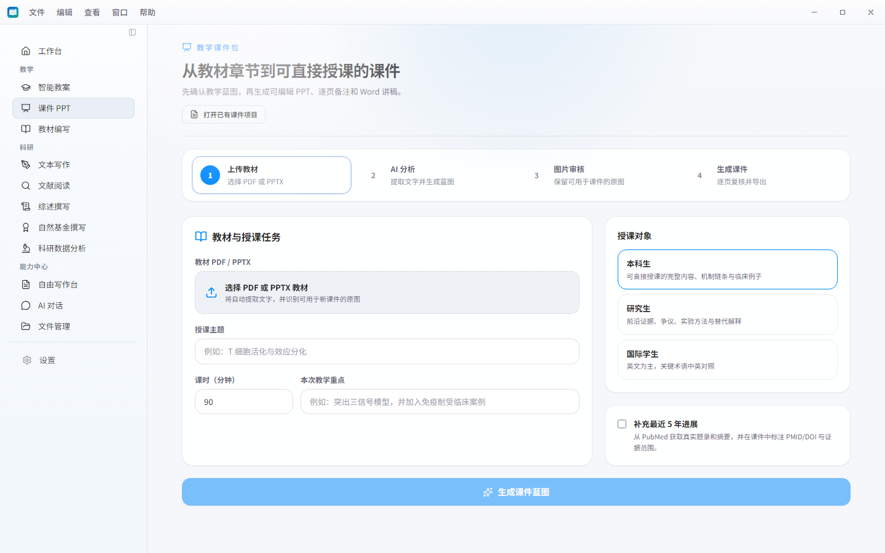

# 智研助手

**专为大学老师设计的 DeepSeek 教学与科研 AI 工作台。不会写代码，也能直接完成备课、课件、文献、写作和科研数据分析。**

[下载 Windows 测试版](https://github.com/fanxin199/zhiyan-desktop/releases) · [查看更新记录](CHANGELOG.md) · [使用与开发文档](#项目文档)

> 当前为 `0.1.0-alpha.1` 测试版，支持 Windows 10/11 x64。安装包尚未配置商业代码签名，Windows 可能显示安全提醒；请只从本仓库的 Releases 页面下载。

## 为什么适合没有代码基础的老师

- **像使用普通办公软件一样简单**：选择功能、添加材料、写下要求，剩下的步骤由 AI 引导完成。
- **页面简洁，任务入口清楚**：教学、科研和通用能力分区展示；常用功能、最近任务和下一步建议集中在工作台。
- **不要求学习 Python 或命令行**：教案、课件、写作、文献阅读和 Office 导出无需 Python；科研数据分析所需环境可在软件内一键安装、修复和管理。
- **不是只能聊天**：结果可以整理到自由写作台，或导出为可继续修改的 DOCX、PPTX、PDF 和项目文件。
- **过程可恢复、结果可追溯**：任务材料、参数、来源和输出记录保存在本地工作区，失败后可从最近成功步骤继续。

## 界面一览

| 清晰的教师工作台 | 从教材生成可编辑课件 |
| --- | --- |
|  |  |

| 无代码科研数据分析 | 简洁的自由写作台 |
| --- | --- |
|  |  |

## 一套软件，覆盖教学与科研常见任务

### 教学

| 功能 | 老师可以做什么 | 可获得的成果 |
| --- | --- | --- |
| 智能教案 | 输入课程、授课对象和章节要求，或添加已有材料 | 结构化教案、课堂活动设计、可编辑 DOCX |
| 课件 PPT | 上传 PDF/PPTX 教材，提取文字和可用图片，生成并审核课件 | 可编辑 PPTX、逐页讲稿 DOCX、课程项目文件 |
| 教材编写 | 按章节逐步撰写，保持教学主线、术语和受众难度一致 | 教材章节、讲义草稿、可编辑 DOCX |

### 科研

| 功能 | 老师可以做什么 | 关键特点 |
| --- | --- | --- |
| 文本写作 | 建立论文或基金写作蓝图，分段撰写、润色和续写 | 锁定科学问题、核心假说、术语和章节边界 |
| 文献阅读 | 添加论文 PDF，围绕具体问题精读正文、图表和结论 | 区分全文、摘要、数据库结果和推断，保留 DOI/PMID 等标识 |
| 综述撰写 | 从研究问题形成中心论点、证据矩阵、章节结构和分段初稿 | 强调证据链，避免把相关性或机制假设写成确定事实 |
| 自然基金撰写 | 梳理立项依据、科学问题、研究内容、技术路线和创新点 | 检查各部分是否相互对应，减少空泛表述 |
| 科研数据分析 | 处理整理后的 bulk RNA-seq 和单细胞下游表格，完成统计与可视化任务 | 软件内管理分析引擎，记录输入、参数、代码、包版本和输出文件 |

### 通用能力

- **自由写作台**：在清爽的编辑界面中管理长文草稿、局部润色，并导出 DOCX/PDF。
- **AI 对话**：极简对话页面，直接描述教学或科研需求；模型与概览信息默认折叠。
- **文件管理**：浏览、预览和安全整理当前工作区文件，高风险操作需要确认。
- **任务衔接**：教案可继续制作课件，文献证据可继续整理为综述，模块结果可发送到自由写作台继续编辑。

## 三步开始使用

1. 从 [GitHub Releases](https://github.com/fanxin199/zhiyan-desktop/releases) 下载 Windows 安装包并安装。
2. 打开“设置”，填写自己的 DeepSeek API Key；软件只在本机保存配置信息。
3. 在工作台选择任务，添加 PDF、PPTX、DOCX、表格或文本材料，然后用日常语言说明需要什么。

> 使用 AI 功能时，任务中选用的内容会发送给所配置的模型服务。请勿上传未经授权的患者隐私、考试保密材料或其他敏感数据。

## Python 需要自己安装吗？

**不需要。** 日常教学、写作、文献阅读和 Office 导出可以直接使用。需要真实统计、绘图或单细胞下游分析时，智研助手会提示“一键安装科研分析引擎”；该环境由软件独立管理，不修改系统 PATH，也不要求老师接触 pip、venv 或终端。

## 产品设计原则

- **教师看任务，不看技术参数**：界面使用“可直接分析”“一键安装”“一键修复”等明确提示。
- **能力按需出现**：不常用的模型、统计概览和高级选项默认收起。
- **输出可继续使用**：优先生成 Office 可编辑文件，而不是只给一段聊天文本。
- **重要操作先确认**：覆盖、删除、移动、安装软件和访问工作区外目录不会静默执行。
- **科研结论有边界**：区分用户材料、全文证据、摘要/元数据、数据库结果、相关性推断和机制假设。

## 当前发布状态

当前版本为个人自用 Alpha，已经完成 701 项自动化测试以及 Windows 成品结构和完整性检查。自动更新暂未启用；正式公开分发前仍需配置 Windows 代码签名并完成更多真实教师设备验证。

## 开发

```powershell
npm ci
npm run hooks:install
npm run dev
```

质量检查：

```powershell
npm test
npm run typecheck
npm run lint -- --max-warnings=0
npm run build
```

Windows 安装包：

```powershell
npm run dist:win
```

## 仓库关系

本仓库采用独立 Git 历史，不配置 DeepSeek-GUI 上游或发布地址。部分基础代码来源于 MIT 授权项目，许可声明见 [THIRD_PARTY_NOTICES.md](THIRD_PARTY_NOTICES.md)。

## 项目文档

- [产品升级执行计划](docs/PRODUCT_UPGRADE_PLAN.md)
- [教师版发布验收](docs/TEACHER_RELEASE_ACCEPTANCE.md)
- [产品路线图](docs/PROJECT_ROADMAP.md)
- [课件素材工作流](docs/COURSEWARE_ARCHITECTURE.md)
- [科研工作台与内置能力规划](docs/RESEARCH_WORKBENCH_PLAN.md)
- [AI 能力与内置 Skills 架构](docs/AI_SKILL_ARCHITECTURE.md)
- [Git hooks 与 worktree 开发流程](docs/DEVELOPMENT.md)
- [仓库目录说明](docs/REPOSITORY_STRUCTURE.md)
